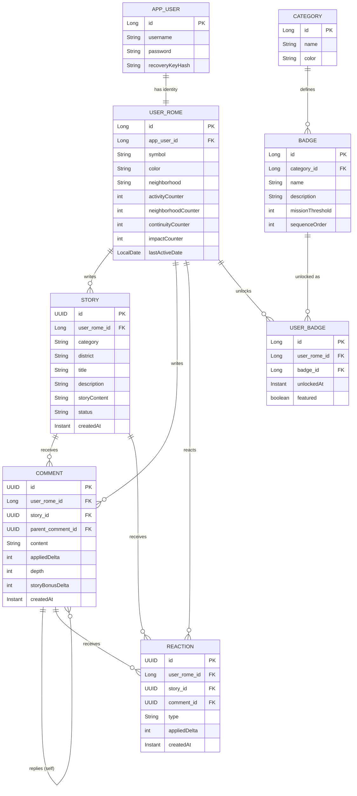

# Scoring and Badges

## Scoring and badge system

Four categories, four counters on `UserRome`. Each category has a series of badges with increasing thresholds: a badge unlocks when the counter reaches its threshold. Badges with threshold 0 are not unlockable by comparison and must be granted as an explicit event (e.g. "Mo Chi Sei?" on registration).

## Concurrent counter updates

The counters on `UserRome` follow a read-decide-write path: the delta depends on the current value, so it must be read before knowing how much to apply. Two parallel transactions on the same user can read the same value and overwrite each other, losing a point with nobody noticing.

`UserRome` therefore carries a `@Version` field. Hibernate increments it on every save and includes it in the update's `WHERE` clause: if the row changed after the read, the update matches nothing and `OptimisticLockingFailureException` is raised.

Optimistic versioning was chosen over a pessimistic lock or an atomic SQL update: a lock would serialize updates on the same user, while an `UPDATE ... SET x = x + 1` cannot express a delta that depends on the value read, and does not return how much was actually applied — information needed to store `appliedDelta`.

### Why the retry sits outside the transaction

The conflict surfaces at commit time, when the transaction is already compromised and bound to roll back. Retrying inside it has no effect: it must close so that the next attempt can open a new one.

That is why `OptimisticRetryServ` is not transactional and is invoked from the controllers, which pass the service call to it as a lambda. Each attempt goes through the Spring proxy and opens its own transaction.

Annotating `@Retryable` directly on a `@Transactional` method, or making the wrapper transactional, looks equivalent but does not work: the retry would run inside the transaction that already failed.

There are three attempts, with no wait between them, and only for `OptimisticLockingFailureException` — any other error surfaces immediately. Once the attempts are exhausted, the exception reaches the exception handler and becomes a 409.

### Activity

Rewards content creation: story +1, comment +1. No deduplication, no floor.

### Neighborhood

Number of distinct districts where the user has active content, computed as the union of the districts of stories they wrote and the districts of stories they commented on. Reactions do not contribute. Recomputed with a query on every action rather than incremented: a user with three stories in the same district counts as 1.

### Continuity

Streak of consecutive days with at least one authenticated access. The first access counts as 1, each consecutive day adds +1, capped at 7. If the streak breaks, it restarts from 1. The `lastActiveDate` field guarantees a single increment per day. A scheduled job resets all counters every Monday (Europe/Rome timezone): users who register mid-week cannot complete the streak that week, and this is intended.

Access tracking happens inside `UserRomeServ.findByAppUserId`, so any authenticated lookup of the user updates the streak — including login, which calls it purely for that side effect and discards the result.

TODO: extract a dedicated `registerDailyAccess(appUserId)` method. The current call reads as dead code at the call site, and the intent is only clear from this note. Update this section when it is done.

### Impact

Score received from others. Like +1, dislike -1, comment received +2, plus a +1 bonus to the story owner when a nested reply arrives, limited to depth 1 and 2. Actions on one's own content generate no score.

### The mirror mechanism

Impact never drops below zero, but dislikes subtract. If the counter is already at 0 and further dislikes arrive, they have no effect — and removing them must not return points, otherwise adding and removing a dislike would become a way to raise someone's score.

Every reaction and every comment stores, at creation time, the delta **actually applied** to the beneficiary's counter:

```
appliedDelta = max(0, currentCounter + weight) - currentCounter
```

On removal nothing is recomputed: the stored value is inverted. A dislike absorbed by the floor has `appliedDelta = 0` and returns 0 when removed.

The value is frozen at creation and never recomputed: recomputing it would make the result depend on the order in which users remove their own votes, producing different outcomes from an identical final state.

The floor applies to the user's total, not to individual content: dislikes on one piece of content can erode points earned from other content.

Comments store two separate deltas — `appliedDelta` toward the owner of the content they reply to, and `storyBonusDelta` toward the story owner — because the two beneficiaries can be different people and must be adjusted separately.

### Content removal — to be defined

Removal endpoints for stories and comments are not yet implemented. The `appliedDelta` and `storyBonusDelta` fields are already persisted in preparation: the inversion will have to read the stored values, never recompute them.

Technical constraint to respect when it is implemented: the inversion must be performed in Java, never delegated to a database `ON DELETE CASCADE`. A cascade would delete descendant comment rows without reabsorbing the points they generated, leaving inflated counters with no trace.

## Schema and constraints

### Reaction uniqueness

A reaction points to either a story **or** a comment: both columns are nullable and exactly one is populated. This constraint is enforced in application code (`ReactionServ`); the database does not verify it.

The "one vote per user per content" constraint cannot be expressed with a standard `UNIQUE` on `(user_rome_id, story_id, comment_id)`: in Postgres two `NULL` values are never considered equal, so two reactions by the same user on the same story — both with a null `comment_id` — do not collide and the constraint never fires.

The real protection is two **partial unique indexes** defined in `schema.sql`, one for reactions on stories (`WHERE comment_id IS NULL`) and one for reactions on comments (`WHERE story_id IS NULL`). The `@UniqueConstraint` annotation on the entity remains as documentation of intent, but is not sufficient on its own.

`schema.sql` runs on every startup (`spring.sql.init.mode=always`), so the indexes use `IF NOT EXISTS`. It also requires `spring.jpa.defer-datasource-initialization=true`, otherwise the script would run before Hibernate has created the tables.

### Comment depth

`depth` is persisted on the entity and computed from the parent (`parent.depth + 1`) rather than by walking up the chain: the story bonus is decided in constant time, with no recursive queries, at any nesting level.

## Entity-relationship diagram



Nullable foreign keys not expressible in the diagram notation: `REACTION.story_id` and `REACTION.comment_id` (exactly one populated, see [Reaction uniqueness](#reaction-uniqueness)), and `COMMENT.parent_comment_id` (null for top-level comments).